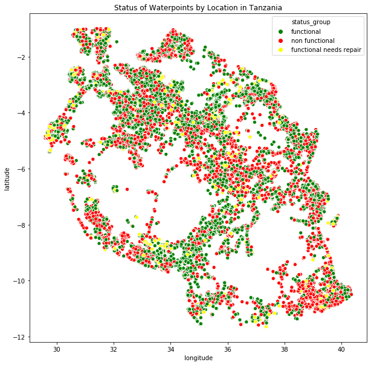

# Functionality of Waterpoints in Tanzania

 
Image [Source](https://www.maji.go.tz/news/makamu-wa-rais-mhe-samia-suluhu-hassan-aweka-jiwe-la-msingi-mradi-wa-maji-mji-wa-muheza)

## Overview

"Tanzania, as a developing country, struggles with providing clean water to its population of over 57,000,000." In order to understand the factors that determine the functionality of a waterpoint, a classification model will be fitted to the data gathered regarding the waterpoints. Throughout this notebook, waterpoint data obtained from drivendata.org will be explored, cleaned and fitted (with appropriately tuned models) in order to predict the functionality of a waterpoint based upon independent variables.

### Raw Data

[Information](https://www.drivendata.org/competitions/7/pump-it-up-data-mining-the-water-table/page/23/) provided about each of the waterpoints include geographical descriptions, management and funding information, source and extraction types, and social/population related demographics. The plot belows visualizes the functionality of the different waterpoints according to their location.

## Exploring the Data

The data is explored by category/subject to determine how much the condition of the category will affect the functionality of the waterpoint. The type of data must be taken into consideration when choosing models to fit to the data. The characteristics of the data will also account for a lot of the noise that the model may see.

## Model

From the results of experimentation and fine tuning, the random forest model was used to determine the functionality of the waterpoints given in this dataset. Below is a confusion matrix (where 1 = functional, 2 = nonfunctional, 3 = functional but needs repair) as well as the accuracy of the data in regards to a reserved testset.

## Summary

From the model chosen, the main factors that drive the model are quantity, waterpoint and extraction type, management type, and payment types. Exploring other ways of gathering data as well as keeping the data more uniform may ultimately help to have much more functioning waterpoints in Tanzania.